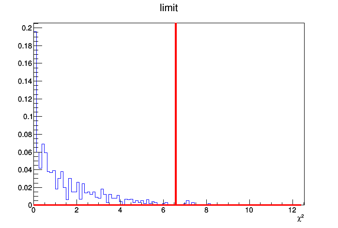

Goodness of fit
====

    http://cms-analysis.github.io/HiggsAnalysis-CombinedLimit/part3/commonstatsmethods#goodness-of-fit-tests
    
    http://cms-analysis.github.io/HiggsAnalysis-CombinedLimit/part3/runningthetool#submission-to-condor
    
Use "saturated" as model.

First run on data:

    combine -M GoodnessOfFit datacard.txt --algo=saturated

Then produce toys.
Local tests:
    
    combine -M GoodnessOfFit datacard.txt --algo=saturated -t 1000 -s 1
    
with condor:

    combineTool.py -M GoodnessOfFit datacard.txt --algo=saturated -t 1 -s 1:1000:1  --toysFreq --job-mode condor --sub-opts='+JobFlavour="espresso"'
    
    
Using snapshot from data:

    
    
Test:

    cd /afs/cern.ch/user/a/amassiro/work/Latinos/Limit/CMSSW_10_2_13/src
    cmsenv
    cd /afs/cern.ch/user/a/amassiro/work/Latinos/Limit/StatisticalTool/GoF
    

    combineCards.py datacard.txt -S > datacard_shape.txt

        
    combine -M GoodnessOfFit datacard.txt       --algo=saturated
    
    combine -M GoodnessOfFit datacard.txt --algo=saturated -t 1000 -s 1
    
    
    
    combine -M GoodnessOfFit datacard_shape.txt --algo=saturated

    
    
    combine -M MultiDimFit     datacard.txt         -t -1  --saveWorkspace     --forceRecreateNLL
    combine -M MultiDimFit     datacard_shape.txt   -t -1  --saveWorkspace
    
    combine  higgsCombineTest.MultiDimFit.mH120.root     --algo=saturated -t 1000 --toysNoSystematics --snapshotName MultiDimFit     -M GoodnessOfFit -s 1 -n TestSnapshot
    
    combine -M GoodnessOfFit datacard_shape.txt --algo=saturated -t 1000 -s 1  --toysFrequentist
    
    
    
Plot:
    
    r99t higgsCombineTest.GoodnessOfFit.mH120.1.root  higgsCombineTest.GoodnessOfFit.mH120.root  draw.cxx
    
    r99t higgsCombineTestSnapshot.GoodnessOfFit.mH120.1.root  higgsCombineTest.GoodnessOfFit.mH120.root  draw.cxx

    r99t higgsCombineTestSnapshot.GoodnessOfFit.mH120.1.root  higgsCombineTest.GoodnessOfFit.mH120.1.root   higgsCombineTest.GoodnessOfFit.mH120.root  drawCompare.cxx

    
Result:

